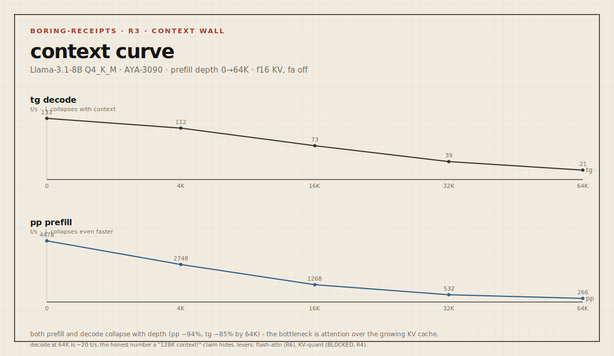

# Boring Receipt - `2026-05-23-3090-llama31-8b-context-sweep`

> Send branch + command shape. We return boring receipts.

| field | value |
|---|---|
| **rung** | toward the long-context heart (axis: context length) |
| **node** | AYA-3090 (Ampere) |
| **date** | 2026-05-23 |
| **axis swept** | prefill depth (`-d`): 0 → 4K → 16K → 32K → 64K, all else fixed |

This isolates **one load axis - context length** - on the same node, model and
quant (Q4_K_M). It is the curve, not a point: speed as a function of how much
context already sits in the KV cache.

## Delta sheet - speed vs context



```
GATE: n/a (throughput/capacity only - no quality probe yet; see next step)

baseline = depth 0

n_ctx     pp prefill t/s            tg decode t/s
   0      4478   █████████  0%      132.7  ███████  0%
  4K      2748   █████      −39%    111.6  █████▇   −16%
 16K      1268   ██         −72%     73.4  ████     −45%
 32K       532   ▏          −88%     39.0  ██       −71%
 64K       266   ▏          −94%     20.5  █        −85%
                 pp: █▅▂▁▁           tg: █▇▄▂▁
```

## Reading

Both curves fall **hard** - and that is the point. On the *quant* axis, prefill
was flat (compute-bound, weight bits don't touch it). Here, on the *context* axis,
**prefill collapses too** (−94% by 64K), even faster than decode (−85%). The
bottleneck is no longer the weights - it is **attention over a growing KV cache**:
every prefilled token and every generated token must attend across all prior
context, and that work scales with context length.

This is exactly the wall TurboQuant exists to push back: in long context the KV
cache is the cost, in compute *and* in memory. A 64K-context decode at 20 t/s on a
3090 is the honest number a "128K context!" claim usually hides.

## Capacity note

KV cache (f16) for this model is ~128 KB/token: ~8 GB at 64K, ~16 GB at 128K. On
the 3090's 24 GB, 128K in f16 KV + the 4.6 GB model crowds the card - the 131072
depth **OOM-stalled** and was excluded. That ceiling is itself the context-capacity
score, and the reason the next rung (KV-dtype `-ctk`/`-ctv`) matters: quantizing
the KV cache is what buys back both the memory and some of the speed.

## Environment

| field | value |
|---|---|
| OS / driver / CUDA | Windows 11 Pro / 566.14 / 12.7 runtime (12.4 build) |
| GPU | RTX 3090 (compute 8.6), 24575 MiB |
| build | llama.cpp b9286 (`99d4026b1`), prebuilt win-cuda-12.4 |
| model | Meta-Llama-3.1-8B-Instruct Q4_K_M, KV f16 |
| dedicated mode | true · resident: none · idle 687 MiB / 45 W |
| reps | 2 |

## Command

```
llama-bench.exe -m Meta-Llama-3.1-8B-Instruct-Q4_K_M.gguf \
  -ngl 99 -p 512 -n 128 -d 0,4096,16384,32768,65536 -r 2
```

## Quality gate (invariant - not exercised)

| field | value |
|---|---|
| signal | (next: needle-retrieval / RULER at each depth) |
| passed | n/a - this receipt measures speed + capacity, not whether the model *uses* the long context |

## What this receipt does not prove

- It does not prove a universal leaderboard result; it proves this command shape on the stated node, runtime, model, quant, context and driver stack.
- It does not prove serving readiness, multi-GPU behavior, other operating systems, other drivers or other model families unless explicitly compared here.
- If the quality gate is marked `n/a` or not exercised, it does not prove behavioral preservation beyond the stated smoke or measurement scope.
- It does not replace the research/probe body in `turboquant-cuda-bench`; it is the public reproducibility card for this run.

## Next step

Two honest follow-ups: (1) a **needle-in-haystack** probe at each depth to prove
the model still *retrieves* across the context it pays for (speed without use is
half a receipt); (2) the **KV-dtype axis** (`-ctk q8_0 / -ctv q4_0`, `-fa on`)  -
re-run this exact curve with a quantized KV cache and report the delta in both
VRAM headroom (does 128K now fit?) and decode speed. That is the TurboQuant-
relevant rung.
