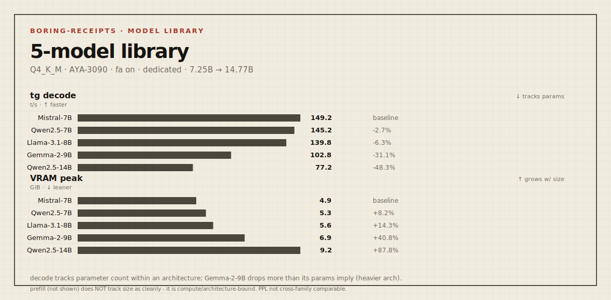

# Boring Receipt - `2026-05-23-3090-qwen25-14b-q4km` (R11)

> Send branch + command shape. We return boring receipts.

| field | value |
|---|---|
| **rung** | model card - largest in the library, **dedicated mode** |
| **node** | AYA-3090 (Ampere) |
| **date** | 2026-05-23 |
| **axis** | model size - Qwen2.5-14B, extends the curve to 14B |

Fifth and largest model. Same node, command, flash-attn on. Notably, it shares the
Qwen2.5 tokenizer with Qwen2.5-7B (R7), so its PPL **is** comparable to the 7B  -
the one within-family quality comparison the library affords.

## The library on AYA-3090 (Q4_K_M, fa on, dedicated), by decode speed



| model | params | pp512 t/s | tg128 t/s | VRAM peak | PPL* |
|---|---|---|---|---|---|
| Mistral-7B-v0.3 | 7.25 B | 5054 | 149.2 | 4.9 GiB | 6.23 |
| Qwen2.5-7B | 7.62 B | 5383 | 145.2 | 5.3 GiB | 8.02 |
| Llama-3.1-8B | 8.03 B | 5000 | 139.8 | 5.6 GiB | 7.50 |
| Gemma-2-9B | 9.24 B | 4052 | 102.8 | 6.9 GiB | 8.80 |
| **Qwen2.5-14B** | **14.77 B** | **2777** | **77.2** | **9.2 GiB** | **6.13** |

`*` PPL comparable **only within a family** (same tokenizer). Qwen2.5-7B (8.02) vs
Qwen2.5-14B (6.13) is valid; the rest are not cross-comparable.

## Reading

**Decode ∝ params holds across the big jump:** Qwen2.5-14B at 14.77B (≈2× the 7B
band) decodes at 77.2 t/s - roughly half the ~145 t/s of the 7B models. Memory
bandwidth is the bottleneck; 2× the weights ≈ half the tokens/s. Prefill drops too
(2777, the lowest in the set).

**Size buys quality - and you can finally see it cleanly:** within Qwen2.5, the 14B
has substantially lower perplexity than the 7B (6.13 vs 8.02). That is the honest
trade the bigger model offers on this card: ~2× better-looking PPL for ~½ the decode
speed and ~2× the VRAM. Whether it's worth it is the user's call - the receipt just
makes the price legible.

**It fits comfortably:** 9.2 GiB peak on the 24 GB 3090, with headroom for
meaningful context. A 14B is a very usable size on a single consumer GPU at Q4.

## Environment

| field | value |
|---|---|
| OS / driver / CUDA | Windows 11 Pro / 566.14 / 12.7 runtime (12.4 build) |
| GPU | RTX 3090 (compute 8.6), 24575 MiB |
| build | llama.cpp b9286 (`99d4026b1`), prebuilt win-cuda-12.4 |
| model | Qwen2.5-14B-Instruct Q4_K_M (bartowski GGUF), KV f16, `-fa 1` |
| dedicated mode | true · resident: none · idle ~580 MiB |
| reps | 5 (throughput) |

## Command

```
llama-bench.exe -m Qwen2.5-14B-Instruct-Q4_K_M.gguf -ngl 99 -p 512 -n 128 -fa 1 -r 5
llama-perplexity.exe -m Qwen2.5-14B-Instruct-Q4_K_M.gguf -f wiki.test.raw -ngl 99 -fa 1
```

## Quality gate

PPL 6.13 (Qwen2.5 family). Within-family: clearly better than the 7B. Cross-family
quality still needs a shared task harness.

## What this receipt does not prove

- It does not prove a universal leaderboard result; it proves this command shape on the stated node, runtime, model, quant, context and driver stack.
- It does not prove serving readiness, multi-GPU behavior, other operating systems, other drivers or other model families unless explicitly compared here.
- If the quality gate is marked `n/a` or not exercised, it does not prove behavioral preservation beyond the stated smoke or measurement scope.
- It does not replace the research/probe body in `turboquant-cuda-bench`; it is the public reproducibility card for this run.

## Next step

The model library is saturated for the night's purpose (7.25B → 14.77B across four
families). See `SUMMARY.md` for the consolidated findings. Open frontier remains the
KV-dtype axis, BLOCKED on the prebuilt (R4).
