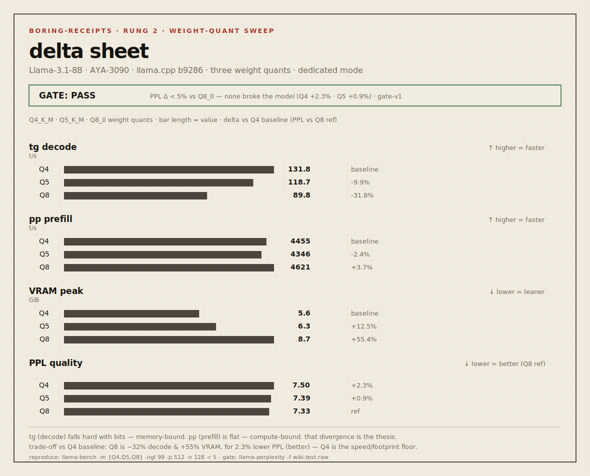

# Boring Receipt — `2026-05-22-3090-llama31-8b-quant-sweep`

> Send branch + command shape. We return boring receipts.

| field | value |
|---|---|
| **rung** | 2 — quant sweep (see ladder in README) |
| **node** | AYA-3090 (Ampere) |
| **date** | 2026-05-22 |
| **axis swept** | weight quant (Q4_K_M → Q5_K_M → Q8_0), all else fixed |

Rung 2 isolates **one load axis** — weight quantization — on the same node, same
model, same command. It shows the speed↔footprint trade-off, and it puts the
prefill/decode separation on display with real numbers.

## Delta sheet



```
┌─ GATE: PASS (gate-v1: PPL Δ < 5% vs Q8_0 ref) ─────────────────────┐
│  All quants preserved the model: Q4 +2.3%, Q5 +0.9% PPL vs Q8.      │
│  So the trade-off is purely speed/footprint, and is sayable in full.│
└─────────────────────────────────────────────────────────────────────┘

baseline = Q4_K_M (speed/footprint) · Q8_0 (quality ref)

                    Q4      Q5       Q8        shape (Q4→Q5→Q8)
tg  (decode) t/s   131.9   118.7    90.3       ▇▅▁   memory-bound: falls hard
                    0%     −10.0%   −31.5%
pp  (prefill) t/s  4459    4347     4542       ▅▅▅   compute-bound: flat (noise)
                    0%     −2.5%    +1.9%
VRAM peak    GiB    6.0     6.7      9.2        ▁▂█   grows with bits
                    0%     +12%     +53%
PPL (gate)         7.5002  7.3948   7.3285     █▅▁   lower = better (Q8 ref)
                   +2.3%   +0.9%    0% (ref)
```

## Reading

The story is the **divergence between the speed sparklines**: `tg ▇▅▁` collapses
while `pp ▅▅▅` stays flat. That is the whole prefill/decode thesis in two rows —
more bits per weight move more memory per token (decode pays), but the prompt is
processed in parallel and is compute-bound (prefill is immune).

Because the **gate passed** (no quant moved PPL by more than 5% vs the Q8_0
reference), the trade-off is now sayable in full: **Q4 is +31.5% faster decode and
−35% VRAM vs Q8, costing +2.3% PPL.** If +2.3% PPL is under your tolerance — and
gate-v1 says it is — Q4 wins on speed and footprint. This is not "Q4 is better"; it
is "Q4 is faster and smaller, and the gate confirms it did not break."

## Environment

| field | value |
|---|---|
| OS | Windows 11 Pro |
| driver / CUDA | 566.14 / 12.7 runtime (12.4 build) |
| GPU | RTX 3090 (compute 8.6), 24575 MiB |
| CPU / RAM | i9-9900K / 64 GB |
| build | llama.cpp b9286 (`99d4026b1`), prebuilt win-cuda-12.4 |
| model | Meta-Llama-3.1-8B-Instruct, source bartowski GGUF |
| power / temp | ~345 W (at 350 W TDP), ≤68 °C — power-limited |
| reps | 5 (tok/s), 3 (telemetry run) |

## Command

```
llama-bench.exe \
  -m Meta-Llama-3.1-8B-Instruct-Q4_K_M.gguf \
  -m Meta-Llama-3.1-8B-Instruct-Q5_K_M.gguf \
  -m Meta-Llama-3.1-8B-Instruct-Q8_0.gguf \
  -ngl 99 -p 512 -n 128 -r 5
```

## Quality gate (invariant — exercised)

| field | value |
|---|---|
| gate version | gate-v1 |
| signal | PPL Δ vs Q8_0 reference, wikitext-2-raw test (4358 lines) |
| criterion | PPL Δ < 5% vs Q8_0 |
| measured | Q4 7.5002 (+2.3%) · Q5 7.3948 (+0.9%) · Q8 7.3285 (ref) |
| passed | **true** — all quants within tolerance |

Gate-v1 is contestable: if your use needs PPL Δ < 1%, Q4 (+2.3%) would *fail* and
Q5 (+0.9%) would pass. Propose another bar and leave a trace (CANON §5).

## Next step

Climb to rung 3 (source build + flash-attn delta) or move to the **KV-dtype axis**
(`-ctk`/`-ctv`) — the TurboQuant-relevant one, where K is far more quant-sensitive
than V and the prefill/decode split sharpens with context length.
