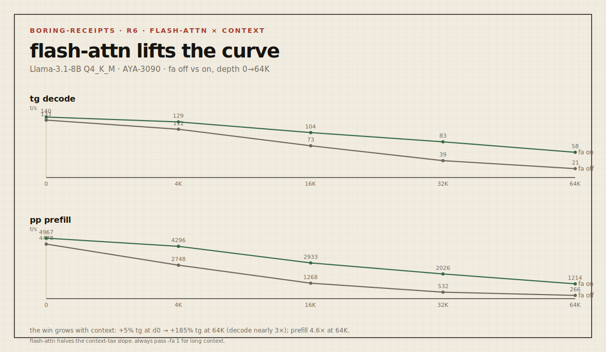

# Boring Receipt — `2026-05-23-3090-llama31-8b-flash-attn-context-curve` (R6)

> Send branch + command shape. We return boring receipts.

| field | value |
|---|---|
| **rung** | 3 — flash-attn × context, **dedicated mode** |
| **node** | AYA-3090 (Ampere) |
| **date** | 2026-05-23 |
| **axis** | prefill depth 0→64K **with `-fa 1`**, vs R3 (same curve, `-fa 0`) |

R6 re-runs the R3 context curve with flash attention on, to chart how far `-fa 1`
pushes the long-context wall at each depth. It is the direct sequel to R3 (the
fa-off curve) and the long-context case for R5 (flash-attn is a free win).

## Delta sheet — flash-attn off (R3) → on (R6)



```
            tg decode t/s              pp prefill t/s
n_ctx     fa0     fa1     Δ          fa0     fa1     Δ
   0     132.7   139.8   +5%        4478    4967   +11%
  4K     111.6   128.6  +15%        2748    4296   +56%
 16K      73.4   103.9  +42%        1268    2933  +131%
 32K      39.0    82.6 +112%         532    2026  +281%
 64K      20.5    58.4 +185%         266    1214  +356%
                  tg fa1: █▇▆▄▂      pp fa1: █▇▅▃▂
```

## Reading

**The gain isn't constant — it scales with context, because that's where
attention cost lives.** At empty context flash-attn barely matters (+5% decode).
By 64K it nearly **triples** decode (20.5 → 58.4 t/s) and gives **4.6×** prefill
(266 → 1214 t/s).

It does not erase the context tax — it halves its slope. fa-off decode falls −85%
from 0→64K; fa-on falls only −58%. So the honest "128K context!" number on a 3090
goes from ~unusable (20 t/s, R3) to merely slow-but-real (58 t/s) just by passing
`-fa 1`. This is the single highest-leverage free flag for long context, and it's
in the stock prebuilt.

The remaining wall (decode still more than halves by 64K) is what KV-cache
quantization would attack — but that path is BLOCKED on this prebuilt (R4).

## Environment

| field | value |
|---|---|
| OS / driver / CUDA | Windows 11 Pro / 566.14 / 12.7 runtime (12.4 build) |
| GPU | RTX 3090 (compute 8.6), 24575 MiB |
| build | llama.cpp b9286 (`99d4026b1`), prebuilt win-cuda-12.4 |
| model | Meta-Llama-3.1-8B-Instruct Q4_K_M, KV f16 |
| dedicated mode | true · resident: none · idle 577 MiB |
| reps | 2 |

## Command

```
llama-bench.exe -m Meta-Llama-3.1-8B-Instruct-Q4_K_M.gguf \
  -ngl 99 -p 512 -n 128 -fa 1 -d 0,4096,16384,32768,65536 -r 2
# fa-off reference: R3 (same command, -fa 0 implied)
```

## Quality gate

n/a — flash attention is numerically equivalent; speed only.

## Next step

KV-dtype is the next lever for the residual wall but is BLOCKED on the prebuilt
(R4) — needs a source build. Meanwhile, broaden the library to other models
(Qwen/Mistral) under the same shape.
