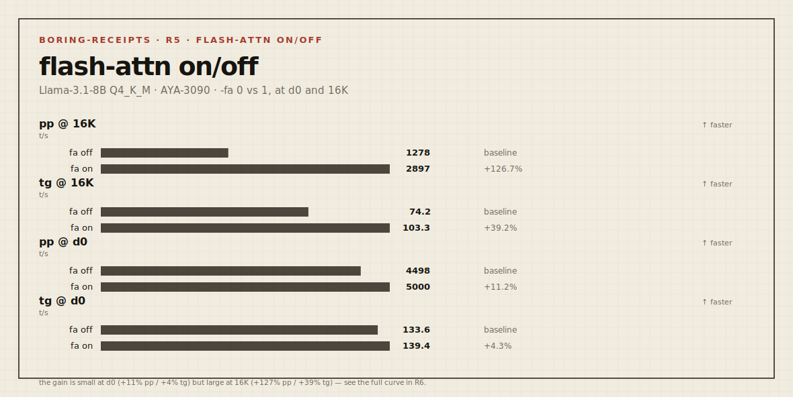

# Boring Receipt — `2026-05-23-3090-llama31-8b-flash-attn` (R5)

> Send branch + command shape. We return boring receipts.

| field | value |
|---|---|
| **rung** | 3 — build/flags (flash-attention), **dedicated mode** |
| **node** | AYA-3090 (Ampere) |
| **date** | 2026-05-23 |
| **axis** | `-fa 0` vs `-fa 1` (flash attention off/on), at depth 0 and 16K |

Rung 3 isolates one runtime flag — **flash attention** — that the prebuilt binary
already ships. No source build needed: just pass `-fa 1`.

## Delta sheet — flash-attn off → on



```
                       fa OFF    fa ON      Δ
pp512 @ d0    t/s       4498      5000     +11.2%   ↑ faster
tg128 @ d0    t/s        133.6     139.4    +4.4%   ↑ faster
pp512 @ 16K   t/s       1278      2897    +126.6%   ↑↑ faster
tg128 @ 16K   t/s         74.2     103.3   +39.2%   ↑↑ faster
```

## Reading

**Flash-attn is a free win, and the win grows with context.** At empty context it's
modest (+11% prefill, +4% decode) — attention is a small slice of the work there.
At 16K context the gain is dramatic: prefill **+127%** (more than 2×) and decode
**+39%**. That is exactly the shape you'd predict: flash attention makes the
attention step cheaper, and attention is the cost that *grows with context*
(see R3, where both curves collapsed with depth). So `-fa 1` directly pushes back
the long-context wall R3 documented — for free, on the stock binary.

Practical takeaway for any Rung-1 noob: **always pass `-fa 1`** on llama.cpp for
long-context work. There is no downside in these runs.

## Environment

| field | value |
|---|---|
| OS / driver / CUDA | Windows 11 Pro / 566.14 / 12.7 runtime (12.4 build) |
| GPU | RTX 3090 (compute 8.6), 24575 MiB |
| build | llama.cpp b9286 (`99d4026b1`), prebuilt win-cuda-12.4 |
| model | Meta-Llama-3.1-8B-Instruct Q4_K_M, KV f16 |
| dedicated mode | true · resident: none · idle 687 MiB / 45 W |
| reps | 3 |

## Command

```
llama-bench.exe -m Meta-Llama-3.1-8B-Instruct-Q4_K_M.gguf \
  -ngl 99 -p 512 -n 128 -fa 0,1 -d 0,16384 -r 3
```

## Quality gate

n/a — flash attention is a numerically-equivalent attention implementation; this
receipt measures speed only. (KV-cache *quantization*, which would need a quality
gate, hangs on this prebuilt — see R4.)

## Next step

Re-run the full R3 context curve (0→64K) with `-fa 1` to chart how far flash-attn
pushes the wall at each depth. And the KV-dtype axis stays BLOCKED on the prebuilt
(R4) until a source build with a working quantized-KV CUDA path.
