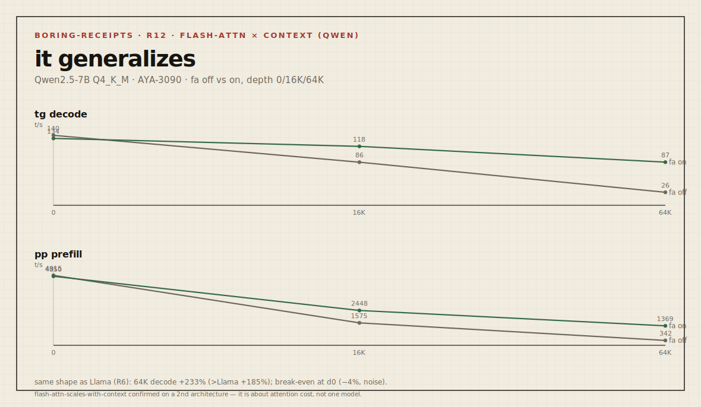

# Boring Receipt — `2026-05-23-3090-qwen25-7b-flash-attn-context-curve` (R12)

> Send branch + command shape. We return boring receipts.

| field | value |
|---|---|
| **rung** | 3 — flash-attn × context, **second architecture**, dedicated mode |
| **node** | AYA-3090 (Ampere) |
| **date** | 2026-05-23 |
| **axis** | `-fa 0` vs `-fa 1` across depth 0/16K/64K on **Qwen2.5-7B** |

Generalization test of R6 (which was Llama-3.1-8B): does the "flash-attn win grows
with context" finding hold on a different architecture? Same role as R10 was for the
quant trade-off.

## Delta sheet — flash-attn off → on, Qwen2.5-7B



```
            tg decode t/s              pp prefill t/s
n_ctx     fa0     fa1     Δ          fa0     fa1     Δ
   0     140.2   134.1   −4%        4915    4850    ~0     (break-even at d0)
 16K      86.4   118.1  +37%        1575    2448   +55%
 64K      26.0    86.5 +233%         342    1369  +300%
```

## Reading — it generalizes, and then some

The shape matches R6 (Llama) closely, confirming the rule is about *attention cost
scaling with context*, not about one model:

| depth | Llama tg Δ (R6) | Qwen tg Δ (R12) |
|---|---|---|
| 16K | +42% | +37% |
| 64K | +185% | **+233%** |

At empty context flash-attn is break-even (Qwen even dips −4%, within run-to-run
noise) — attention is a tiny slice there. By 64K it **more than triples** Qwen decode
(26 → 86.5 t/s), an even larger gain than Llama saw. So the finding is now confirmed
on two architectures: **`-fa 1` is the single highest-leverage free flag for
long-context throughput, and its payoff scales with how much context you actually
use.** The break-even at d0 also explains why nobody notices it on short prompts —
the win is invisible until the context is long.

## Environment

| field | value |
|---|---|
| OS / driver / CUDA | Windows 11 Pro / 566.14 / 12.7 runtime (12.4 build) |
| GPU | RTX 3090 (compute 8.6), 24575 MiB |
| build | llama.cpp b9286 (`99d4026b1`), prebuilt win-cuda-12.4 |
| model | Qwen2.5-7B-Instruct Q4_K_M (bartowski GGUF), KV f16 |
| dedicated mode | true · resident: none · idle ~597 MiB |
| reps | 2 |

## Command

```
llama-bench.exe -m Qwen2.5-7B-Instruct-Q4_K_M.gguf -ngl 99 -p 512 -n 128 -fa 0,1 -d 0,16384,65536 -r 2
```

## Quality gate

n/a — flash attention is numerically equivalent; speed only.

## Next step

Flash-attn finding confirmed cross-architecture (R6 Llama + R12 Qwen). See
`SUMMARY.md`. Open frontier stays the KV-dtype axis (BLOCKED on the prebuilt, R4).
